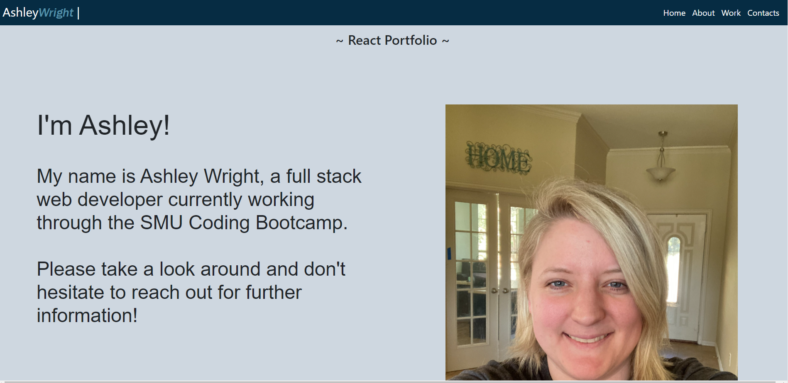

# ReactPortfolio

## Table of Contents

1. [Description](#Description)
2. [Criteria](#Criteria)
3. [Installation](#Installation)
4. [Usage](#Usage)
5. [Contributing](#Contributing)
6. [Issues](#Issues)
7. [Credits](#Credits)
8. [License](#License)
9. [Questions](#Questions)

## Description

Re-creating my portfolio, but using React and React Router. Getting the styles to work was a little confusing, but I managed to more or less get it to work.

I'd like to go back later and fix the issue with the footer not staying at the bottom, and maybe changing the header so it has something that conditionally renders.

[Deployed website](https://ashleyaggie.github.io/ReactPortfolio/)

Example picture:

## Criteria

* Updated portfolio featuring 6 total projects

* Use React

* A `Header` component that appears on multiple pages

* A single `Project` component that will be used multiple times on a single page 

* Navigation with React Router, dynamic rendering, or another third part router

* A `Footer` component that appears on multiple pages

* Update GitHub profile with pinned repositories featuring those same projects

## Installation

Files must be downloaded from Github. Then run npm install to get the necessary node modules. Lastly run npm start.

A ready version is also available at the [deployed website.](https://ashleyaggie.github.io/ReactPortfolio/)

## Usage

Portfolio for the programmer displaying information about me, six previous projects I've worked on, and ways to contact me.

## Contributing

For contributions, please create a fork to work on then, when done, create a Pull Request.

## Issues

Submit an Issue through Github for any bugs or problems.

## Credits

Assignment was developed as part of the SMU Coding Bootcamp.

## License

Copyright Ashley Wright 2021

This is covered under the <a href='https://choosealicense.com/licenses/gpl-3.0/'>ISC</a> license.

## Questions

Feel free to contact through the following with any questions:

Email: ashleyaggie@aol.com

Github: <a href='https://github.com/ashleyaggie'>ashleyaggie</a>